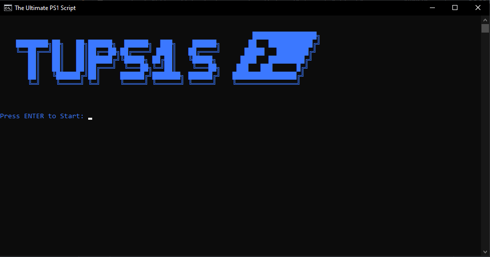

<p align=center>
  <br>
  <a href="#" target="_blank"></a>
</p>

<p align="center">

[//]: # (  <a href="#installation">Installation</a>)

[//]: # (  &nbsp;&nbsp;&nbsp;|&nbsp;&nbsp;&nbsp;)

[//]: # (  <a href="#usage">Usage</a>)

[//]: # (  &nbsp;&nbsp;&nbsp;|&nbsp;&nbsp;&nbsp;)

[//]: # (  <a href="#contributing">Contributing</a>)
</p>

<p align="center">


</p>

# Installation

## Option 1
Download the Zip file of this Git Repository and unzip it wherever you like.

## Option 2
Clone the repository using the following command:
Git is required to be installed on your system for this to work.

```cmd
git clone https://github.com/M4rshe1/tups1s.git
```

# Usage
To start the program you have to start the ``start.bat`` in the root folder of this project.  
it is not possible to start the program from another location.  
If you want to have the program on your desktop you can create a shortcut to the ``start.bat`` file, or you have to move the hole project to your desktop.

## Updating
To Update the program, start it by clicking on the ``start.bat`` file.  
Then enter 1 and press enter to start the update process.  
Git is required to be installed on your system for this to work.

# Script Documentation

- [Ping Tool](USB/docs/ping_tool.md)

# other Documentation

## Tools
[USB/Tools](USB/Tools)  
In this folder you can find some helpful tools that are not coded by me.  
These tools are some normal tools that you can find on the internet like:
- [Advanced IP Scanner](USB/Tools/Advanced_IP_Scanner_2.5.3850.exe)
- [Chrome](USB/Tools/ChromeSetup.exe)
- [WireShark](USB/Tools/Wireshark-win64-3.4.6.exe)
- [Putty](USB/Tools/putty.exe)
- [etc.](USB/Tools)

## Keys
[USB/Keys](USB/Keys)  
In this folder you can find some license keys for some tools.

