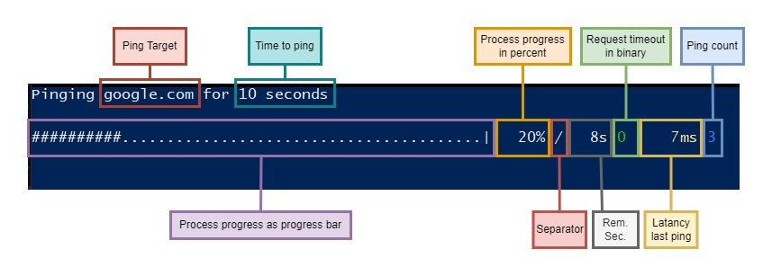
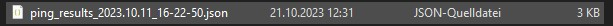
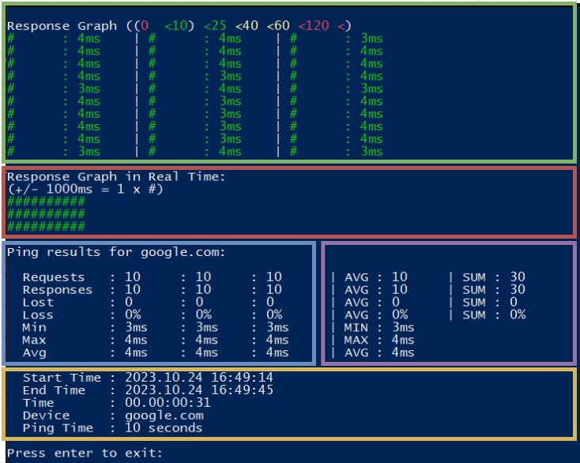
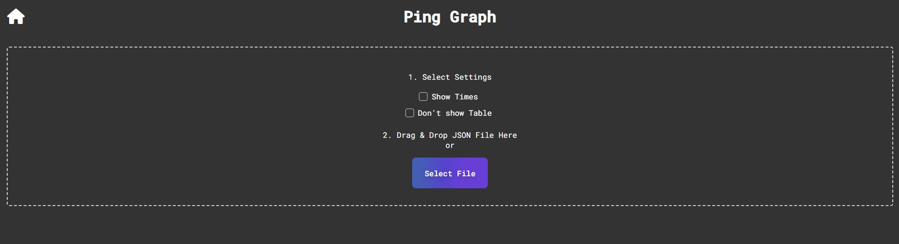
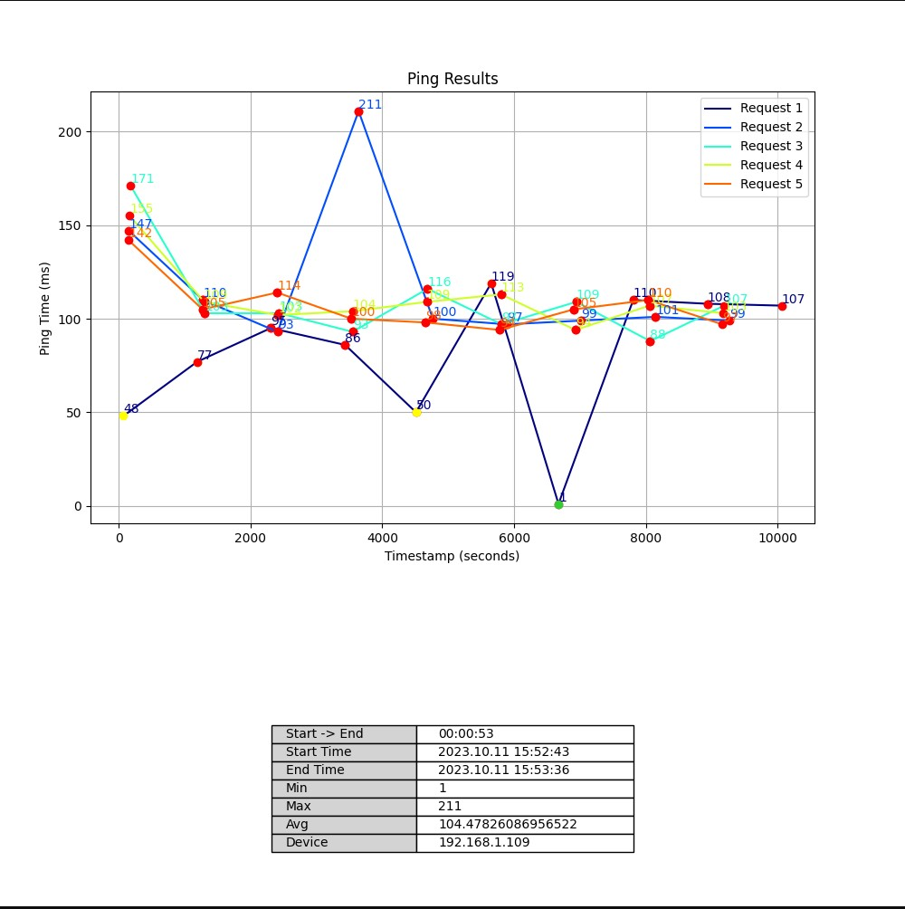

# Ping Tool
[Ping Tool Script](../Scripts/ping_tool/ping_tool.ps1)


## Description
The Program is written in Powershell, it is also available as a standalone executable or as a python script.

The Ping tool ist a tool to capture the data from multiple ping sessions. The data is stored in a json file that is saved in the downloads' folder.  
The Data can be displayed in the program itself or as a graph using the [Ping Tool API](https://api.heggli.dev/ping_graph) from the API HUB.

## Usage
It is available as a:
- [Powershell script](../Scripts/ping_tool/ping_tool.ps1)
- Python script
- [Standalone executable](../Scripts/ping_tool/ping_tool.exe)
- Web runable version (``irm https://api.heggli.dev/ping | iex``)

### Requirements
- Powershell 5.1 or higher
- Windows 10 or higher
- Internet connection (Graph generation)
- ``Set-ExecutionPolicy RemoteSigned`` **(run as admin)**   
  - This is required to run the script, it can be reverted after the script has been executed. 
  - Without this, it will only be able to run scripts by copying and pasting the source code into a powershell terminal.

### step 1
The Powershell script can be executed by running the `ping_tool.ps1` file
or by copy and pasting the source code into a powershell terminal.

### step 2
Select what you want to do by entering the corresponding letter and pressing enter.
Default is `p` for ping.
```
What would you like to do?
  p - ping device
  l - load ping results from file
  c - continue to ping
  g - generate graph
  m - merge ping results
  s - split results
>> :
```

jump to  
[p - ping device](#p1)  
[l - load ping results from file](#l1)  
[c - continue to ping](#c1)  
[g - generate graph](#g1)  
[m - merge ping results](#m1)  
[s - split results](#s1)  

### <a id="p1"></a>step p.1
Enter the IP address or hostname of the device you want to ping.
Default is `google.com` (can be specified in the script)

### step p.2
Enter how long you want to ping the device in the following formats:
- `10` for 10 seconds
- `10s` for 10 seconds
- `10m` for 10 minutes

### step p.3
Wait for the ping to finish.  

The data will automatically be displayed after it finishes, here more [detailed explanation](#l2)  

If you want to scann again press enter, otherwise enter `n` and press enter to save the data and close the script.


### <a id="l1"></a>step l.1
After you pressed enter an explorer select window will open for you to select a json file that was generated by the powershell, python or executable version.



### <a id="l2"></a>step l.2
The Loaded/ping data is split into 3 parts.

At the end, you have the option of creating a graphic if you enter g and press enter.
For a more detailed description of how to create a graphic, [click here](#g1).


**<a id="datapoints"></a><span style="color:green">GREEN</span>**  
In the green Part there are all ping sessions listed horizontally with every ping and there latency.
Left of the latency is bar with a length between 1 and 6  
- **<span style="color:Red">0</span>** Means the target has **not responded**  
- **<span style="color:green">#</span>** Means the target responded **under 10 ms**  
- **<span style="color:green">##</span>** Means the target responded **under 25 ms**  
- **<span style="color:yellow">###</span>** Means the target responded **under 40 ms**  
- **<span style="color:yellow">####</span>** Means the target responded **under 60 ms**  
- **<span style="color:red">#####</span>** Means the target responded **under 120 ms**  
- **<span style="color:red">######</span>** Means the target responded took **more than 120 ms**

**<span style="color:red">RED</span>**  
I this section all ping sessions are listed vertically where 1000 ms is represented by 1 symbol.
This means that if an answer has a duration of **2365 ms**, there are 2 symbols for it.
If there is no answer, it is represented by <span style="color:red">0000</span>.
The colours are assigned the same as in the previous graphic.


**<span style="color:blue">BLUE</span>**  
The summarised data of the various ping sessions are displayed vertically here.  

**<span style="color:Violet">VIOLET</span>**  
The summarised data of th howl line is displayed here.

**<span style="color:yellow">YELLOW</span>**  
General information is displayed here.
- Start time of the first ping session
- End time of the last ping session
- Time from start of session 1 to end of last session
- Ping target
- The time of a single session in seconds



### <a id="g1"></a>step g.1
A web page should now open, that looks like this.

Fist select you settings by selecting the Checkboxes, an explanation about what it does it provided by overing over it.  
After that, select a json file that was generated by the powershell, python or executable version.
The website will automatically go on when a file is selected.

[//]: # (```)

[//]: # (###################################################################################)

[//]: # (# When you are navigating throu the website by using the arrows from the browser  #)

[//]: # (# you have to relode the page otherwise it will not work.                         #)

[//]: # (###################################################################################)

[//]: # (```)


### <a id="g1"></a>step g.2
If you select all settings, it will look something like this.  
- Option 1 (Show Times): displays the time in ms beside the datapoint.
- Option 2 (Show Table): displays the table at the bottom.  

The file can normally downloaded by right-clicking and click save as.

**GRAPH**  
At the top we see all Ping seasons with their chronicle order.
The data points will have a color corresponding to their values defined [here](#datapoints).   
if there was no respond there will be an `X` instead of a dot.

**TABLE**  
The Table will display pretty much be the same as the [Blue and Yellow Part](#l2) of the loading function.




### <a id="c1"></a>step c.1
After you pressed enter the program will open an explorer window for you to select a json file, from an earlier ping session.
It will then continue to ping the device, with the same settings as the previous session, after you pressed enter.

### <a id="m1"></a>step m.1
After you pressed enter the program will open an explorer window for you to select a json files, from earlier ping sessions.
It will then merge the data from the files into one file, after you pressed enter.
The sequence of the files is important, the first file will be the first ping session and the last file will be the last ping session.

### <a id="s1"></a>step s.1
After you pressed enter the program will open an explorer window for you to select a json file, from an earlier ping session.
It will then split the data from the file into its individual ping sessions, after you pressed enter.
The data will be saved in the same in a folder with the same name as the file.


